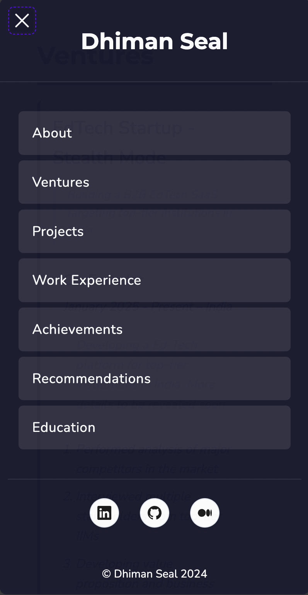

# dhi13man-portfolio

A personal portfolio website showcasing achievements, ventures, work experiences and projects of Dhiman Seal.

The website is built using HTML, CSS, and JavaScript. It is designed to be responsive and mobile-friendly.

It is deployed on <https://dhimanseal.com>.

## Structure

- assets – Images and icons.  
- scripts – Front-end functionality.  
- styles – CSS files.  
- data – Public JSON for structured data.  

## Usage

1. Open index.html in a browser or serve the folder using any local server.  
2. Explore additional pages like projects.html to view detailed projects.

## Screenshots

| About Page - Desktop  |
| --------------------- |
|  |

| Ventures Page - Mobile | Menu Open - Mobile |
|------------------------|--------------------|
|  |  |

## Contributing

Fork or clone the repository, then modify HTML, CSS, or JS files as needed. Pull requests are welcome.

## License

This project is licensed under the MIT License. See the [LICENSE](LICENSE) file for details.
